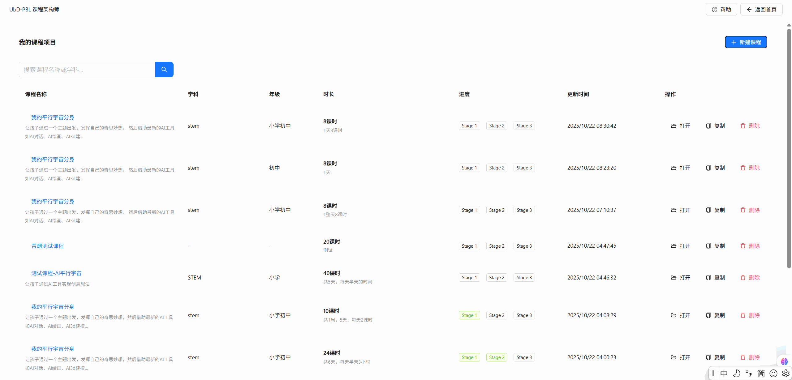
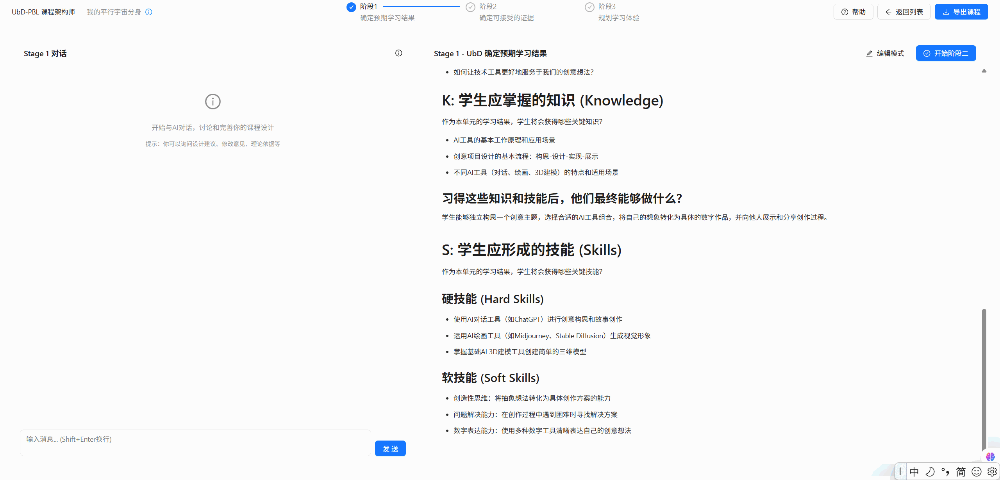

# 🤖 PBLCourseAgent

> AI-Powered PBL Course Designer with Visual Task-Driven Canvas
> 基于AI的项目式学习课程设计助手

[](https://opensource.org/licenses/MIT)
[](https://www.python.org/downloads/)
[](https://reactjs.org/)
[](https://www.typescriptlang.org/)

PBLCourseAgent 是一个基于Understanding by Design (UbD)框架的AI驱动课程设计工具。它通过**三Agent智能系统 + ChatGPT式对话界面**的方式，帮助教育者快速创建专业的项目式学习(PBL)课程方案。

## 📸 产品预览

<!--
截图1: 产品主界面
位置: docs/screenshots/main-interface.png
内容: 打开 http://localhost:3000 后的完整主界面
建议: 包含左侧输入表单和右侧空白的输出区域，展示初始状态
尺寸: 1920x1080 或更高
-->


<!--
截图2: 课程生成中
位置: docs/screenshots/generation-in-progress.png
内容: 点击"生成课程方案"后，展示三个Agent正在工作的状态
建议: 捕捉"正在生成..."的流式输出过程，最好能看到部分生成的内容
尺寸: 1920x1080 或更高
-->



<!--
截图3: 完整课程方案
位置: docs/screenshots/complete-course.png
内容: 生成完成后，展示完整的三阶段输出结果
建议: 向下滚动，展示"项目基础定义"、"评估框架"、"学习蓝图"三个部分
尺寸: 全屏截图或长截图
-->
### 📄 查看完整课程方案

[👉 点此查看完整方案截图（complete-course.md）](docs/screenshots/complete-course.md)


## ✨ 核心特性

- 🎯 **UbD逆向设计**: 遵循Understanding by Design框架的三阶段课程设计流程
- 🤖 **三Agent智能系统**: ProjectFoundation → AssessmentFramework → LearningBlueprint 顺序生成
- 💬 **ChatGPT式交互**: 基于Ant Design X的流畅对话界面，支持上下文对话和历史记录
- ⚡ **SSE流式生成**: Server-Sent Events实时推送生成进度，60-90秒完成完整课程方案
- 📝 **双模式编辑器**: 查看/编辑模式随时切换，支持Markdown格式导出
- 🎓 **内置学习支持**: 新手引导、UbD帮助文档、质量指示器，降低学习门槛

## 🎯 当前版本 (V3)

### ✅ 已实现的核心功能

- **UbD三阶段设计流程**: 确定预期结果 (G/U/Q/K/S) → 确定评估证据 (驱动性问题+表现性任务) → 规划学习体验 (PBL四阶段+WHERETO)
- **ChatGPT式AI对话**: 基于Ant Design X的流畅交互界面，支持上下文对话和历史记录
- **SSE流式生成**: 实时显示Agent生成进度，60-90秒完成完整课程方案
- **语义质量验证**: 自动检测"持续理解(U)"的抽象性，提供改进建议
- **项目管理**: 课程项目列表、编辑、导出、变更检测
- **新手友好**: 内置帮助文档、5步引导教程、UbD概念Tooltips

### 🚧 正在完善的功能

- [ ] 级联重生成：修改Stage 1后自动提示重新生成Stage 2/3
- [ ] 性能优化：组件懒加载、缓存策略
- [ ] 完整测试套件：E2E测试、单元测试覆盖
- [ ] Docker一键部署

## 🏗️ 技术架构

### 系统架构

```
┌──────────────────────────────────────────────────────────┐
│  前端 (React + TypeScript + Vite + Ant Design)         │
│  ┌─────────────────┐  ┌──────────────────────────────┐  │
│  │   HomePage      │  │   CourseDesign View          │  │
│  │ ┌─────────────┐ │  │ ┌────────┐    ┌───────────┐ │  │
│  │ │项目列表     │ │  │ │ChatPanel│    │ContentPanel│ │
│  │ │创建课程     │ │  │ │(AI对话) │    │(结构化内容)│ │
│  │ └─────────────┘ │  │ └────────┘    └───────────┘ │  │
│  └─────────────────┘  └──────────────────────────────┘  │
│                 ↕ HTTP/SSE                               │
│  ┌─────────────────────────────────────────────────────┐│
│  │   Zustand Store (课程状态 + 对话历史 + 生成进度)    ││
│  └─────────────────────────────────────────────────────┘│
└──────────────────────────────────────────────────────────┘
                         ↓ RESTful API + SSE
┌──────────────────────────────────────────────────────────┐
│  后端 (FastAPI + SQLAlchemy + SQLite)                   │
│  ┌─────────────────┐  ┌──────────────────────────────┐  │
│  │  API Routes     │  │   三Agent工作流              │  │
│  │ /courses        │  │  ProjectFoundation V3        │  │
│  │ /workflow/stream│→ │  AssessmentFramework V3      │  │
│  │ /chat/send      │  │  LearningBlueprint V3        │  │
│  └─────────────────┘  └──────────────────────────────┘  │
│                                ↓                         │
│  ┌──────────────────────────────────────────────────┐   │
│  │ Services (Validation + Export + Conversation)     │   │
│  └──────────────────────────────────────────────────┘   │
└──────────────────────────────────────────────────────────┘
                         ↓ OpenAI API
                   ┌─────────────────┐
                   │  OpenAI GPT-4o  │
                   └─────────────────┘
```

### 技术栈

| 层级 | 技术选择 | 版本 | 用途 |
|------|----------|------|------|
| **前端框架** | React + TypeScript + Vite | 19 / 5.9 / 7.0+ | 现代化单页应用 |
| **UI组件库** | Ant Design + Ant Design X | 5.27+ / 1.6+ | 企业级UI + AI对话组件 |
| **状态管理** | Zustand | 5.0+ | 轻量级响应式状态 |
| **Markdown** | react-markdown + remark-gfm | 10.1+ | 内容渲染和编辑 |
| **后端框架** | FastAPI | 0.100+ | 高性能异步API |
| **ORM** | SQLAlchemy | 2.0+ | 数据库抽象层 |
| **数据库** | SQLite | - | 轻量级持久化 (MVP) |
| **AI引擎** | OpenAI API | GPT-4o | LLM推理 |
| **验证** | Pydantic | 2.0+ | 数据验证和序列化 |
| **语义分析** | sentence-transformers | - | U vs K质量检测 |

### 核心组件

#### 后端Agent系统
- **ProjectFoundationAgent V3**: 生成G/U/Q/K/S，定义课程核心目标
- **AssessmentFrameworkAgent V3**: 设计驱动性问题和表现性任务
- **LearningBlueprintAgent V3**: 规划PBL四阶段学习体验
- **WorkflowService V3**: SSE流式协调三Agent顺序执行
- **ValidationService**: 语义验证"持续理解(U)"的抽象性
- **ConversationService**: 管理AI对话历史和上下文

#### 前端组件系统
- **HomePage**: 项目列表和创建入口
- **ChatPanel**: Ant Design X驱动的AI对话界面
- **ContentPanel**: 结构化展示UbD三阶段内容
- **MarkdownEditor**: 双模式编辑器 (查看/编辑)
- **StepNavigator**: Stage 1/2/3导航切换
- **HelpDialog**: UbD框架学习文档
- **OnboardingOverlay**: 5步新手引导

## 🚀 快速开始

### 环境要求

- Python 3.10+
- Node.js 16+
- [uv](https://docs.astral.sh/uv/) - 现代Python包管理器
- OpenAI API密钥 (或兼容的LLM API)

### 安装步骤

1. **安装uv（如果还没有）**
   ```bash
   # Windows
   powershell -ExecutionPolicy ByPass -c "irm https://astral.sh/uv/install.ps1 | iex"

   # macOS/Linux
   curl -LsSf https://astral.sh/uv/install.sh | sh
   ```

2. **克隆项目**
   ```bash
   git clone <repository-url>
   cd eduagents
   ```

3. **后端设置**
   ```bash
   cd backend

   # 安装依赖（使用uv包管理器）
   uv sync

   # 配置环境变量
   cp .env.example .env
   # 编辑.env文件，填入你的API密钥:
   # PBL_AI_API_KEY=your_api_key
   # PBL_AI_BASE_URL=http://your-api-endpoint/v1
   # PBL_AI_MODEL=gpt-4o  # 或其他兼容模型
   ```

4. **前端设置**
   ```bash
   cd frontend-x

   # 安装依赖
   npm install
   ```

5. **启动服务**

   **方式一：手动启动（推荐用于开发）**
   ```bash
   # Terminal 1: 启动后端
   cd backend
   uv run uvicorn app.main:app --reload --host 0.0.0.0 --port 48097

   # Terminal 2: 启动前端
   cd frontend-x
   npm run dev
   ```

   **方式二：快速启动脚本**
   ```bash
   # 确保已配置.env文件
   python quick_start.py
   ```

6. **访问应用**
   - 前端界面: http://localhost:48098
   - 后端API: http://localhost:48097
   - API文档: http://localhost:48097/docs


## 📋 使用指南

### 基本工作流程

1. **创建课程项目** → 在首页点击"新建课程"，填写基本信息
2. **AI自动生成** → 系统自动生成UbD三阶段内容 (60-90秒)
3. **AI对话完善** → 在ChatPanel与AI交流，优化课程设计
4. **查看和编辑** → 在ContentPanel查看结构化内容，切换编辑模式修改
5. **导出教案** → 下载Markdown格式的完整UbD教案文档

### 创建课程时填写信息

访问 http://localhost:5173 后，点击"新建课程"填写：

1. **课程名称**: 例如 "AI音乐制作工作坊"
2. **学科领域**: 例如 "音乐 + 技术"
3. **年级**: 例如 "7-9年级"
4. **总课时**: 例如 "40课时"
5. **课程安排**: 例如 "5天，每天半天"
6. **课程描述**: 简要说明课程目标和项目内容


### AI生成的UbD三阶段内容

系统将按照UbD逆向设计框架生成完整的课程方案：

#### Stage 1: 确定预期学习结果
   - **G (Goals)**: 迁移目标 - 学生能在新情境中应用的能力
   - **U (Understandings)**: 持续理解 - 学生永恒记住的核心观点
   - **Q (Questions)**: 基本问题 - 引导探究的开放性问题
   - **K (Knowledge)**: 关键知识 - 学生需要掌握的事实和概念
   - **S (Skills)**: 关键技能 - 学生需要形成的能力

#### Stage 2: 确定可接受的证据
   - **驱动性问题**: 贯穿整个项目的核心挑战
   - **表现性任务**: 学生需要完成的真实情境任务
   - **评估量规**: 4级评分标准 (新手→学徒→工匠→大师)
   - **其他证据**: 形成性评估方法和工具


#### Stage 3: 规划学习体验和教学
   - **PBL四阶段**: 项目启动 → 知识建构 → 开发迭代 → 成果展示
   - **WHERETO原则**: 每个活动标注对应的教学设计原则
   - **详细时间线**: 每日/每课时的具体活动安排
   - **教师准备**: 所需材料、场地、工具清单
   - **学生任务**: 每个阶段学生的具体工作内容


## 🧪 测试

```bash
# 运行单元测试
cd backend
uv run pytest app/tests/ -v

# 运行特定测试
uv run pytest app/tests/test_workflow_service.py -v

# 运行黄金标准测试（需要API密钥）
uv run pytest app/tests/test_golden_standard.py::TestGoldenStandard::test_golden_standard_quality -v -s

# 运行测试并生成覆盖率报告
uv run pytest app/tests/ --cov=app --cov-report=html
```

## 📊 性能指标

根据PRD要求，系统性能目标：

- **总响应时间**: < 90秒
- **Agent 1**: < 20秒
- **Agent 2**: < 25秒
- **Agent 3**: < 40秒
- **质量得分**: > 80%（相对黄金标准）

## 📁 项目结构

```
eduagents/
├── backend/                 # Python FastAPI后端
│   ├── app/
│   │   ├── agents/          # 三个AI Agent (V3版本)
│   │   │   ├── project_foundation_v3.py
│   │   │   ├── assessment_framework_v3.py
│   │   │   └── learning_blueprint_v3.py
│   │   ├── api/v1/          # API端点
│   │   │   ├── course.py    # 课程CRUD
│   │   │   ├── generate.py  # SSE流式生成
│   │   │   └── chat.py      # AI对话接口
│   │   ├── models/          # SQLAlchemy数据模型
│   │   │   ├── course_project.py
│   │   │   └── stage_data.py
│   │   ├── services/        # 业务逻辑
│   │   │   ├── workflow_service_v3.py
│   │   │   ├── validation_service.py
│   │   │   ├── conversation_service.py
│   │   │   └── export_service.py
│   │   ├── prompts/phr/     # Prompt History Records
│   │   │   ├── project_foundation_v2.md
│   │   │   ├── assessment_framework_v2.md
│   │   │   └── learning_blueprint_v2.md
│   │   ├── templates/       # Jinja2模板
│   │   │   └── course_export_v3.md.jinja2
│   │   └── tests/           # 测试套件
│   └── pyproject.toml       # uv项目配置
│
├── frontend-x/              # React + TypeScript前端 (当前版本)
│   ├── src/
│   │   ├── components/      # React组件
│   │   │   ├── HomePage.tsx
│   │   │   ├── ChatPanel.tsx
│   │   │   ├── ContentPanel.tsx
│   │   │   ├── MarkdownEditor.tsx
│   │   │   ├── ProjectListView.tsx
│   │   │   ├── HelpDialog.tsx
│   │   │   ├── OnboardingOverlay.tsx
│   │   │   ├── ChangeDetectionDialog.tsx
│   │   │   ├── StepNavigator.tsx
│   │   │   └── ErrorBoundary.tsx
│   │   ├── hooks/           # Custom Hooks
│   │   │   ├── useStepWorkflow.ts
│   │   │   ├── useChatConversation.ts
│   │   │   └── useMarkdownSync.ts
│   │   ├── services/        # API调用
│   │   │   ├── workflowService.ts
│   │   │   ├── conversationService.ts
│   │   │   └── courseService.ts
│   │   ├── stores/          # Zustand状态管理
│   │   │   └── courseStore.ts
│   │   ├── types/           # TypeScript类型
│   │   │   └── course.ts
│   │   └── constants/       # 常量定义
│   │       ├── layout.ts
│   │       └── ubdDefinitions.ts
│   └── package.json
│
├── docs/                    # 文档
│   ├── user-guide-v3.md     # 用户指南
│   ├── screenshots/         # 产品截图
│   └── UBD教案模板.md
│
├── specs/                   # 规格文档
│   └── 001-ubd-pbl-architect-v3/
│       ├── spec.md          # 功能规格
│       ├── plan.md          # 实施计划
│       └── tasks.md         # 任务清单
│
├── CLAUDE.md               # Claude Code开发配置
├── quick_start.py          # 快速启动脚本
└── README.md               # 本文件
```

## 🔧 开发指南

### 后端开发 (uv管理)

```bash
# 查看虚拟环境信息
cd backend && uv info

# 添加新的生产依赖
uv add requests

# 添加新的开发依赖
uv add --dev pytest-mock

# 更新所有依赖
uv sync --upgrade

# 进入虚拟环境shell
uv shell

# 运行代码质量检查
uv run black . && uv run isort . && uv run flake8

# 导出requirements.txt（如需要）
uv export --format requirements-txt --output requirements.txt
```

### 前端开发 (npm管理)

```bash
cd frontend-x

# 安装新依赖
npm install package-name

# 开发模式启动（热重载）
npm run dev

# 构建生产版本
npm run build

# 代码检查
npm run lint

# 类型检查
npx tsc --noEmit
```

### 关键开发路径

**后端核心文件:**
- Agent实现: `backend/app/agents/*_v3.py`
- API路由: `backend/app/api/v1/*.py`
- 业务逻辑: `backend/app/services/*.py`
- Prompt管理: `backend/app/prompts/phr/*.md`
- 测试: `backend/app/tests/*.py`

**前端核心文件:**
- 主应用: `frontend-x/src/App.tsx`
- 组件: `frontend-x/src/components/*.tsx`
- 状态管理: `frontend-x/src/stores/courseStore.ts`
- API服务: `frontend-x/src/services/*.ts`
- 类型定义: `frontend-x/src/types/course.ts`

## 📈 未来路线图

### 短期计划 (V3.1)
- [ ] 级联重生成：修改Stage 1后自动提示重新生成Stage 2/3
- [ ] 性能优化：组件懒加载、API缓存策略
- [ ] E2E测试：完整的端到端测试覆盖
- [ ] Docker部署：一键容器化部署

### 中期计划 (V4)
- [ ] 多项目管理：课程文件夹、标签分类
- [ ] 协作功能：课程分享、团队协作
- [ ] 模板库：内置多种课程设计模板
- [ ] 质量提升：更智能的语义验证和建议

### 长期愿景
- [ ] 多语言支持：国际化i18n
- [ ] 用户系统：账户管理、云端存储
- [ ] 移动端：响应式设计优化
- [ ] AI增强：更多教学设计辅助功能

## 🤝 贡献

欢迎提交Issue和Pull Request！

1. Fork项目
2. 创建功能分支 (`git checkout -b feature/AmazingFeature`)
3. 提交更改 (`git commit -m 'Add some AmazingFeature'`)
4. 推送到分支 (`git push origin feature/AmazingFeature`)
5. 开启Pull Request

## 📄 许可证

本项目采用MIT许可证 - 详见 [LICENSE](LICENSE) 文件

## 👨‍💼 联系我们

- 项目维护者: AI Teaching Innovation Team
- 邮箱: [your-email@example.com]
- 项目主页: [GitHub Repository URL]

---

**让AI为教育赋能，让每一位教育者都能创造世界级课程！** 🎓✨